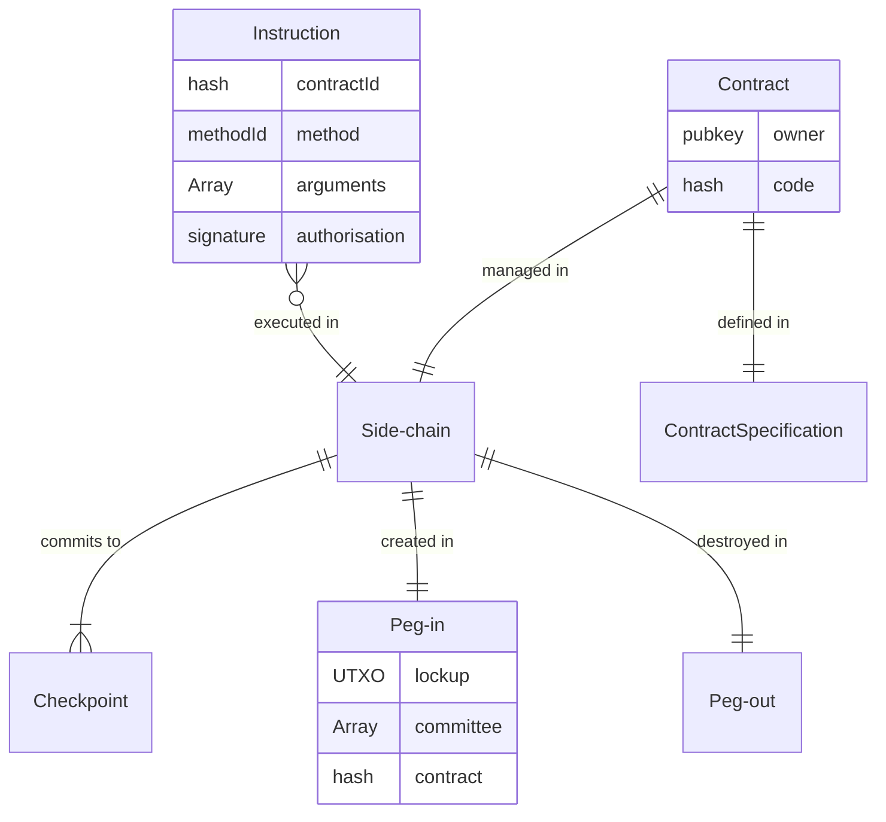

# RFC-0312/DANSpecification

## High level Digital Asset Network Specification

**Maintainer(s)**: [Cayle Sharrock](https://github.com/CjS77)

# Licence

[The 3-Clause BSD Licence](https://opensource.org/licenses/BSD-3-Clause).

Copyright 2019 The Tari Development Community

Redistribution and use in source and binary forms, with or without modification, are permitted provided that the
following conditions are met:

1. Redistributions of this document must retain the above copyright notice, this list of conditions and the following
   disclaimer.
2. Redistributions in binary form must reproduce the above copyright notice, this list of conditions and the following
   disclaimer in the documentation and/or other materials provided with the distribution.
3. Neither the name of the copyright holder nor the names of its contributors may be used to endorse or promote products
   derived from this software without specific prior written permission.

THIS DOCUMENT IS PROVIDED BY THE COPYRIGHT HOLDERS AND CONTRIBUTORS "AS IS", AND ANY EXPRESS OR IMPLIED WARRANTIES,
INCLUDING, BUT NOT LIMITED TO, THE IMPLIED WARRANTIES OF MERCHANTABILITY AND FITNESS FOR A PARTICULAR PURPOSE ARE
DISCLAIMED. IN NO EVENT SHALL THE COPYRIGHT HOLDER OR CONTRIBUTORS BE LIABLE FOR ANY DIRECT, INDIRECT, INCIDENTAL,
SPECIAL, EXEMPLARY OR CONSEQUENTIAL DAMAGES (INCLUDING, BUT NOT LIMITED TO, PROCUREMENT OF SUBSTITUTE GOODS OR
SERVICES; LOSS OF USE, DATA OR PROFITS; OR BUSINESS INTERRUPTION) HOWEVER CAUSED AND ON ANY THEORY OF LIABILITY,
WHETHER IN CONTRACT, STRICT LIABILITY OR TORT (INCLUDING NEGLIGENCE OR OTHERWISE) ARISING IN ANY WAY OUT OF THE USE OF
THIS SOFTWARE, EVEN IF ADVISED OF THE POSSIBILITY OF SUCH DAMAGE.

## Language

The keywords "MUST", "MUST NOT", "REQUIRED", "SHALL", "SHALL NOT", "SHOULD", "SHOULD NOT", "RECOMMENDED",
"NOT RECOMMENDED", "MAY" and "OPTIONAL" in this document are to be interpreted as described in
[BCP 14](https://tools.ietf.org/html/bcp14) (covering RFC2119 and RFC8174) when, and only when, they appear in all capitals, as
shown here.

## Disclaimer

This document and its content are intended for information purposes only and may be subject to change or update
without notice.

This document may include preliminary concepts that may or may not be in the process of being developed by the Tari
community. The release of this document is intended solely for review and discussion by the community of the
technological merits of the potential system outlined herein.

## Goals

This document describes the high-level, or informal specification for how digital assets are created, managed, secured, and wound-
down on the Tari digital asset network (DAN).

The document covers, among other things:

* The relationship of side-chains to digital assets,
* Required characteristics of side-chains,
* Peg-in and peg-out mechanisms,
* Digital asset template minimum requirements,
* Validator node requirements,
* Checkpoint and refund mechanisms

This RFC covers a lot of ground. Therefore the intent is not to provide a detailed, code-ready specification for the
entire DAN infrastructure; those are left to other RFCs; but to establish a foundation onto which the rest of the DAN
specifications can be built.

This RFC supersedes and deprecates several older RFCs:

- [RFC-0300: Digital Assets Network](RFCD-0300_DAN.md)
- [RFC-0301: Namespace Registration](RFC-0301_NamespaceRegistration.md)
- [RFC-0302: Validator Nodes](RFCD-0302_ValidatorNodes.md)
- [RFC-0304: Validator Node committee selection](RFCD-0304_VNCommittees.md)
- [RFC-0345: Asset Life cycle](RFC-0345_AssetLifeCycle.md)

Several RFC documents are in the process of being revised in order to fit into this proposed framework:

* [RFC-0300: The Digital Assets Network](RFCD-0300_DAN.md)
* [RFC-0340: Validator Node Consensus](RFC-0340_VNConsensusOverview.md)

### Motivation

There are many ways to skin a cat.
The philosophy guiding the approach in the RFC is one that permits
scaling of the network to handle in the region of **1 billion messages per day** (network-wide) and
**1 million digital assets** with **near real-time user experience** on asset state retrieval, updating and transfer,
on a sufficiently decentralised and private basis.

The definition of _sufficient_ here is subjective, and part of the design philosophy of Tari is that we leave it up to the
user to determine what that means, keeping in mind that there is always a trade-off between decentralisation, performance,
and cost.

For some assets, decentralisation and censorship resistance will be paramount, and users will be willing to live with a
more laggy experience. Gamers in a Web 3.0-MMORPG on the other hand, want cheap, fast transactions with verifiable ownership, and
therefore will generally need to sacrifice decentralisation for that.

The goal of the DAN is for asset issuers to be able to configure the side-chain for their project to suit their particular
needs.

## Description

There are several key actors that participate in Tari Digital Asset Network:

* A tari [contract] is a piece of code that establishes the relationship and rules of engagement between one or more
  digital assets. This includes ownership rules, transfer rules and state change rules.
* The [Asset issuer] is the entity that defines a contract and brings it into existence.
* [Validator node]s manage the contract on behalf of the asset issuer by executing instructions on a Tari [side-chain].
* [Users] interact with contracts and may own, transfer or execute state change instructions against the contract by
  submitting instructions via the Tari [comms network] to the relevant validator node committee.

### The role of the Layer 1 base chain

The Tari Overview RFC describes [the role of the base layer].
In summary, the base layer maintains the integrity of the Tari cryptocurrency token, and maintains registers of the side-chains,
validator nodes and contract templates.

It does not know about or care about what happens in the side chains as long as the Tari consensus, side-chain and
validator node rules are kept.

One can view the base layer blocks and transactions as an immutable, append-only document which is the physical manifestation
of a traditional database. The rows are represented by the UTXOs and we can infer which table the row belongs to by inspecting
the output features of the UTXO.

Whereas a standard RDMS manages access control and permissions via policy, we must also take care to ensure proper access control
via consensus rules, lock scripts, covenants, signatures and kernels.

### Top-level requirements for side-chains

The guiding principle of Tari contracts are that they are managed on a dedicated side-chain. One side-chain,
one contract.
Other RFCs will discuss ways to overcome the apparent limitations this rule implies, including inter-contract
interactions and asset hibernation.

#### Asset issuer <-> Validator node agreements

The fundamental relationship of Tari contracts is between the asset issuer and the validator node(s) that manage
the contract's side-chain. This relationship is somewhat adversarial by nature: Issuers want high quality service at
the lowest possible price; Validators want to be compensated for their services and under some circumstances may want
to cheat on contracts for their own gain.

Tari seeks to address this in the lightest way possible by requiring the absolute minimum in terms of base layer governance
while providing options for side-chain governance that suits the needs of the parties involved.

For example, an asset
issuer that wants to issue a highly decentralised, censorship-resistant _high-value_ contract on a side-chain would likely
seek to recruit dozens of validator nodes and run a proof-of-stake consensus model with a confidential asset specification.

In contrast, an asset issuer that wants to participate in the Tari ecosystem, but is not interested in decentralisation
could run their own validator node; with no consensus, or staking, or validator node compensation contracts -- these
would be unnecessary; and provide a high performance, real-time contract. Games with realistic embedded economics would
follow this model, as well as early on in the transition from tradFi to deFi.

A set of Validator nodes that manage the same contract is called the _validator node committee_ for the contract.

### The Asset issuer
[asset issuer]: #asset_issuer

The asset issuer, otherwise known as the contract owner, is the entity that publishes a [contract creation transaction].

* The asset issuer MAY transfer ownership of a contract to a new entity.
* The asset issuer MAY migrate a contract to a new version.

OPEN QUESTION: What rights are unquestionably given to the owner? Maybe the covenant should be somewhat flexible.
Contracts that do not allow the owner to deregister it will be more trustworthy than those that do.

#### The role of validator nodes

* Validator nodes SHOULD diligently and accurately [process all instructions] related to the contract.
* The committee SHOULD reach consensus on every instruction related to the contract. This specification does NOT dictate how this
  consensus is reached. If the committee contains one member, then consensus is trivial, and does not require any complicated
  consensus algorithms. A standard web-based application stack will suffice in most cases.
  Larger committees can choose from any manner of consensus algorithms, including PBFT, HotStuff, proof-of-stake or
  proof-of-work.

**OPEN QUESTION**: The asset issuer has no in-band way to know how the VNs are reaching consensus. Even out-of-band,
there could be one server and a bunch of proxies that merely relay messages. Only proof of work (because it is permissionless)
and proof of stake (maybe?) work around this problem. We need some sort of proof-of-uniqueness mechanism here... :thinking:

The Tari base layer does not get involved in governance issues. However, many asset issuers may want to include mechanisms
that, for example, require a Tari stake to act as a validator node. Validator nodes may also desire a compensation
mechanism so that they get paid for managing the contract. These mechanisms form part of the contract itself, and are
opaque to the machinery of the base layer, side-chain and associated peg transactions.

Validator nodes should expect to have to stake Tari for each contract they validate. Asset issuers will determine the
nature and amount of stake required. The contract stake is variable on a contract-to-contract basis so that an
efficient market
between asset issuers and validator nodes can develop. This market is not defined on the Tari blockchain at all and
would be implemented as a DAO on the DAN itself.

Similarly, it has been suggested in the past that Validator Nodes should post hardware benchmarks when registering. The problem
with this requirement is that it is fairly trivial to game. We cannot enforce that the machine that posted the benchmark
is the same as the one that is running validations.

A better approach is to leave this to the market. A reputation contract can be built, on Tari, of course, that
periodically and randomly asks Validator Nodes to perform cryptographically signed benchmarks in exchange for performance
certificates. Nodes can voluntarily sign up for such a service and acts as a form of credential. Nodes that do not sign
up may have trouble finding contracts to validate and might have to lower their price to get work.

Tari [contract]s are template-based, and so many contracts may wish to include templates that add one or more of the
following functionality to the side-chain contract:

* A Validator node [proof-of-participation certificate] template. Poorly performing validator nodes may receive reduced compensation,
  be fined, or even ejected from the committee at a checkpoint.
* An asset financing template. The asset issuer could provide a guaranteed pool of funds from which the committee will
  be paid at every checkpoint.
* Tari account template. This template would provide the ability for users to deposit Tari into a side-chain, withdraw
  funds at checkpoints and track their balances throughout the lifetime of the contract.

This list is far from complete, but should convey the idea that:

* Tari contracts SHOULD be highly modular and composable, with each template performing exactly ONE highly specific
  task, and doing it very well.
* The base layer and peg transactions know the absolute minimum about the assets on the chain. However, they provide
  all the information necessary for the contract templates and side-chains to function efficiently.

### The contract lifecycle
[contract lifecycle]: #the-contract-lifecycle "The contract lifecycle"

Every contract MUST be governed by one, and only one, Tari [side-chain]. A contract MAY define one or more digital assets.
This contract can be very simple or highly complex.

The lifecycle of a contract proceeds via these steps:

1. The asset issuer publishes a [contract definition transaction].
2. The asset issuer publishes a [validator committee proposal] transaction.
3. Once this transaction is published, we enter the [acceptance period].
4. Each validator node that will be managing the contract publishes a [contract acceptance transaction]. The group of
   validator nodes is called the Validator Node Committee (VNC).
5. Once the [acceptance period] has expired, [peg-in period] begins.
6. The VNC jointly publishes a [peg-in transaction].
7. At this point, the contract is considered live, and users can interact with the contract on the side-chain.
8. The VNC periodically publishes a [checkpoint transaction]. 
9. Failure to do so can lead to the contract being [abandoned].
10. The VNC may opt shut the contract down by publishing a [peg-out transaction].

The following sections will discuss each of these steps in more detail.

#### Contract instantiation
[contract instantiation]: #contract-instantiation "Contract Instantiation"

Steps 1 - 6 in the [contract lifecycle] are part of the [contract instantiation] process. It is a multi-step process 
and is ideally represented as a finite-state machine that reacts to transactions published on chain that contain outputs 
containing specific output features. The combination of output features and FSM allows nodes to accurately track the 
progress of potentially thousands of contracts in a safe and decentralised manner.

#### The contract definition transaction
[contract definition transaction]: #the-contract-definition-transaction "The contract definition transaction"

It bears repeating that every contract is governed by one, and only one, Tari [side-chain]. A contract MAY 
define one or more digital assets. These assets' behaviour is captured in [templates] and are highly composable.
This allows the contract to be very simple or highly complex, and be handled with the same contract handling machinery.

<note :tip>
The contract definition transaction defines the "what" of the digital asset set that will be created.
</note>

The contract definition transaction MUST provide 
* the full contract specification, OR a hash of the full contract specification
* and initial data. This is immutable for the lifetime of the contract.

This data tells validator nodes _exactly_ what code will be running, and the data needed to initialise that code.

Asset templates will have a strictly defined interface that includes a constructor, or initialisation method. The 
parameters that these constructors define is what determined the initial data.

These two pieces of data are _necessary_ AND _sufficient_ to enable _any_ validator node to start running the contract
and execute instructions on it.

* Every contract MUST be registered on the base layer.
* Contracts MUST be registered by publishing a `contract definition` transaction.
* The following information must be captured as part of the `contract definition` transaction in a contract
  definition UTXO:
  * Exactly ONE output MUST have a `ContractDefintion` output feature.
  * A `ContractDefintion` UTXO has the following information:
    * the asset issuer's public key, also known as the owner public key, `<PublicKey>`.
    * The contract id -- `<u256 hash>`. This is immutable for the life of the contract and is calculated as
      `H(contract_name || contract specification hash || Initial data hash)`.
    * A contract name -- `utf-8 char[32]`(UTF-8 string) 32 bytes. This is for informational purposes only, so it shouldn't
      be too long, but not too short that it's not useful (this isn't DOS 3.1 after all). 32 bytes is the same length as
      a public key or hash, so feels like a reasonable compromise.

* The [!]:
  * Version number (contract code definition can be upgraded)
  * The template hash being implemented

* The [contract code definition] also includes the initial state (hash?) for the contract.
  * e.g. all the sub-templates and their state.

The contract definition MUST UTXO hold at least the `MINIMUM_OWNER_COLLATERAL` in Tari.

The owner collateral is a small staked amount of at least `MINIMUM_OWNER_COLLATERAL`. The amount is hard-coded into
consensus rules and is a nominal amount to prevent spam, and encourages asset owners to tidy up after themselves when
a contract winds down.

Initially, `MINIMUM_OWNER_COLLATERAL` is set at 200 Tari, but MAY be changed across network upgrades.

Assuming the collateral is represented by the UTXO commitment $C = kG + vH$, the minimum requirement is verified by
having the range-proof commit to $(k, v - v_\mathrm{min})$ rather than the usual  $(k, v)$. Note that this change requires us to modify the
`TransactionOutput` definition to include a `minimum_value_commitment` field, defaulting to zero, to capture this extra information.

* The owner collateral UTXO MUST have the `TRANSACTION_DEFINITION` output feature flag set.
* The owner collateral MUST include a covenant that only permits it to be spent to a new `TRANSACTION_DEFINITION` UTXO (when
  transferring ownership of a contract), or as an unencumbered UTXO in a `CONTRACT_DEREGISTRATION` transaction. 
  TODO: This transaction is desirable because it tidies up the UTXO set. But this tx cannot be published before the VN
  shuts the contract down via a [peg-out transaction].

#### The validator committee proposal
[validator committee proposal]: #the-validator-committee-proposal "The validator committee proposal"

  * The asset issuer broadcasts a [validator committee proposal] transaction.
    * This transaction defines the "how" and "who" of the digital asset's management.
    * It links to the contract definition UTXO.
    * This transaction contains the "contract terms" for the management of the contract.
    * This transaction contains the public keys of the proposed VN committee; 
    * a expiry date before which all the VNs must sign and agree to these terms (the [acceptance period]]); 
    * quorum conditions for acceptance of this proposal (default to 100%);
    * this MUST be achieved by the asset issuer providing a UTXO that can only be spent by a multisig of the quorum of
      VNS performing a peg-in. There MAY be an [initial reward] that is paid to the VN committee when the UTXO is spent.
    * part of this agreement MAY be a [side-chain deposit] amount that needs to be committed as part of the [peg-in];
    * quorum conditions for peg-outs (e.g. I require a 3 of 5 threshold signature); In this instance peg-outs refer to an exit
      of the entire side-chain. We envisage that depositing and withdrawing funds into / out of the SC can be done via
      a template and will vary depending on the template (e.g. custodial vs self-custody / refund tx).
    * The advertised consensus model for the side chain (this can't be enforced, but can be checked); 
    * Checkpoint parameters, including, frequency, rules around committee changes.

If both the [acceptance period] and [peg-in period] elapses and quorum, the asset owner MAY spend the validator 
committee proposal UTXO back to himself to recover his funds.

#### The contract acceptance transaction
[contract acceptance transaction]: #the-contract-acceptance-transaction "The contract acceptance transaction"

The asset issuer must then find a set of validator nodes that will manage the contract. This is typically done 
out-of-band, via a DEX, DAO or other marketplace. The VNs could also be owned by the issuer itself.

  * Validator nodes MUST cryptographically [acknowledge and agree] to manage the contract.
  * Each VN publishes a [contract acceptance transaction] committing the required stake. The UTXO is also an explicit 
      agreement to manage the contract.
  * In a PoW side chain, we still need a VN to act as "checkpoint publisher", so this step is still required for PoW 
      chains.
  * The UTXO has a time lock, that prevents the VN spending the UTXO before the [acceptance period] + [peg-in period] 
      has lapsed.

#### The peg-in period
[peg-in period]: #the-peg-in-period "The peg-in period"

Once the [acceptance period] has expired, [peg-in period] begins.

At this point, VNs that have accepted the contract must
    * allocate resources
    * Setup whatever is needed to run the contract
    * Set up consensus with their peer VNs (e.g. hotstuff)
    * Intialise the contract and run the constructors
    * Reach consensus on the initial state.
    * Prepare the [peg-in] transaction.

all before the [peg-in] period expires.
  
#### The peg-in transaction
[peg-in transaction]: #the-peg-in-transaction "The peg-in transaction"
  
Side-chains MUST be initiated by virtue of a [peg-in] transaction.

* Once the [acceptance period] has expired, [peg-in period] begins.
* At this point, there MUST be a quorum of acceptance transactions from validator nodes. 
  validator node committee MUST collaborate to produce, sign and broadcast the peg-in transaction by spending the 
  [initial reward]. This also serves the purpose of linking the peg-in to the specific contract that is being 
  managed by the side-chain.
* There is a minimum [side-chain deposit] that MUST be included in the peg-in UTXO. A single aggregated UTXO 
  containing at least $$ m D $$ Tari, where _m_ is the number of VNs and _D_ is the deposit required.
* This transaction also acts as the zero-th checkpoint for the contract. As such, it requires all the checkpoint 
  information.
* The state commitment is the merklish root of the state after running the code initialisation using the [initial 
  data] provided in the [contract definition].

#### Checkpoint transactions
[checkpoint]: #checkpoint-transactions "Checkpoint transactions"

* Validator nodes MUST periodically sign and broadcast a [checkpoint] transaction.
  * The checkpoint UTXO MUST have the `CHECKPOINT` output feature.
  * It contains the [contract_id]
  * This feature contains a commitment to the current contract state. This is typically some sort of Merklish root.
  * A checkpoint number, strictly increasing by 1 form the previous checkpoint
  * The checkpoint MUST spend the previous checkpoint. This is guaranteed by virtue of a covenant.
  * The checkpoint UTXO contains a covenant that provides the spending conditions described above.
  * Checkpoints allow the exit and entrance of new validator nodes into the committee.
* A checkpoint MAY introduce a new Validator Node public key into the VN committee
  * The conditions for adding a new key to the VN committee set are specified in the [contract definition]
  * Note: At the minimum, there's a proposal step, a validation step, an acceptance step, and an activation step.

* The validator node committee MUST post periodic [checkpoints] onto the base layer.
  * The checkpoint MUST include a [summary of the contract state]. This summary SHOULD be in the form of a Merklish Root.
  * The checkpoint MUST include [refund information] for Tari holders in the side-chain.
  * The checkpoint MUST spend the old contract funding UTXO into a new funding UTXO, taking any withdrawals and new deposits
    into account.
* If a valid checkpoint is not posted within the maximum allowed timeframe, the contract is [abandoned]. This COULD lead
  to penalties and stake slashing if enabled within the contract specification.
* A checkpoint MAY define [validator node committee updates].

### Other considerations and specifications

The following requirements aren't part of the contract lifecycle specifically, but are needed to remove ambiguity.

#### Template code registration and versioning

The code template implementations MUST be registered on the base layer.

The reason for this is that it allows Validator Nodes to know unequivocally that they are all running the same code
and can expect the same output for the same input.

Template registration also allows us to implement a secure and trust-minimised upgrade mechanism for templates. 

Potentially, we could even introduce a mechanism wherein template developers get paid for people using their template.

Template registration UTXO would contain:
  * A link to the code (git commit or IPFS)
  * The type of code (source or binary blob)
  * A hash of the source code / blob
  * Version info.
  * [Execution engine] requirements (similar to solc pragma)

There's a clear upgrade path, since
there's a code-chain from one version of a contract template to the next.

---> Review marker
#### Contract user accounts
[contract user accounts]: #contract-user-accounts

Tari uses the UTXO model in its ledger accounting. On the other hand Tari side-chains SHOULD use an account-based system
to track balances and state.

The reasons for this are:

* An account-based approach leads to fewer outputs on peg-in transactions. There is roughly a 1:1 ratio of users
  to balances in an account-based system. On the other hand there are O(n) UTXOs in an output-based system where `n` are
  the number of transactions carried out on the side-chain. When a side-chain wants to shut down, they must record a new
  output on the base layer for every account or output (as the case may be) that they track in the peg-out transaction(s).
  It should be self-evident that account-based systems are far more scalable in the vast majority of use-cases.
* Following on from this, Accounts scale better for micro-payment applications, where hundreds or thousands of tiny 
  payments flow between the same two parties.
* Many DAN applications will want to track state (such as NFTs) as well as currency balances. Account-based ledgers make
  this type of application far simpler.

Tari side-chain accounts MUST be representable as, or convertible to, a valid base layer UTXO.

When a side-chain pegs out, either partially (when users withdraw funds) or completely (when the side-chain shuts down),
all balances MUST be returned to the base layer in a manner that satisfies the Tari base layer consensus rules.

##### Pedersen commitments and account-based ledgers

Standard Pedersen commitments are essentially useless in account-based ledgers.

The reason being that since the spending keys would be common to all transactions involving a given account, it is trivial
to use the accounting rules to cancel out the `k.G` terms from transactions and to use a pre-image attack to unblind all
the values.

The specific protocol of user accounts in the side-chain is decided by the asset issuer.

Options include:

* Fully trusted

In this configuration, the side-chain is controlled by a single validator node, perhaps a server running an RDMS.
The validator node has full visibility into the state of the side chain at all times. It may or may not share this
state with the public. If it does not, then the situation is analogous to current Web 2.0 server applications.

* Decentralised and federated

In this configuration, a distributed set of validator nodes maintain the side-chain state. The set of nodes are fixed.
If consensus between nodes is achieved using a mechanism such as HotStuff BFT, very high throughputs can be achieved.

* Decentralised and censorship resistant

In this configuration, the side-chain could itself be a proof-of-work blockchain. This offers maximum decentralisation,
and censorship resistance. However, throughput will be lower.

* Confidentiality

As mentioned above, Pedersen commitments are not suitable for account-based ledgers. However, the [Zether] protocol
was expressly designed to provide confidentiality in a smart-contract context. It can be combined with any of the above
schemes. Zether can also be [extended](https://github.com/ConsenSys/anonymous-zether) to provide privacy by including
a ring-signature scheme for transfers.

#### Side-chain funding transaction

Goals: To allow anyone to 'deposit' Tari into a side-chain

* An output MUST have an output type of `FUNDING`
  * The contract ID MUST be provided
  * The contract ID MUST match a currently active contract
  * The output MAY indicate the unblinded amount (for side chains that are not confidential) and a proof that the
    commitment matches the amount (by signing a message with the spend key of the commitment)
* The transaction MUST be a one-sided payment into the public key of the asset funding address

On confirmation:

* Validator nodes SHOULD credit a new account for the user for the amount deposited.

#### Withdrawal transactions

Goal: Allows users to securely withdraw funds and tokens from the side-chain.
In general, sum(funding txs for the contract) + seed fund = sum(disbursements) + remaining contract fund.

1. All inputs MUST be owned by the contract's [funding address].
2. The transaction type MUST be `PegOut`, to satisfy the covenant.
3. The spending signature must be a threshold signature of the authorised signers for the contract
4. Not all funds need to be spent. Change MUST be a one-sided payment into the Funding address
5. Client outputs have no spending restrictions.

- When do peg-outs happen [?]
- What type of address do clients provide? OSP?

#### Refund transactions

If a contract is abandoned by validator nodes, then there is a dilemma: We can only refund people in accordance with the
last known state of the ledger. Therefore, we MUST record refund information into every checkpoint, so that we can at least
recover the majority of the side-chain's history in the event of a forced refund.

Goal: To commit to the contract state at the time of the checkpoint.
Including, to allow users to have a recent claim on side-chain funds in the event that the contract is abandoned.

The state checkpoint consists of :

- A timestamp
- contract ID
- Checkpoint number (strictly incremented by one from previous checkpoint number)
- A hash or merkle root of the contract state
- A merkle root of the refund data
- data from [Asset registration transaction] ?

Refund data:

- A merkle tree of (account balance / commitment, refund address)

Account holder (wallets) MUST keep a local copy of a merkle proof of their latest (C, address) pair.

VNs MUST provide clients with this data when queried.

Spending conditions:

- No new checkpoint for a contract has been published in `CHECKPOINT_MAX_TIMEOUT` blocks.
- The tx input is a `PegIn` type.
- One or more (C, Address) is provided.
- A merkle proof for the (C, Address) pairs that matches the last checkpoint merkle root is provided.
- The (C, Address) pairs have not been spent before. [?? with pruning , could be tricky to check]
- Change address MUST be an identical UTXO as the `PegIn` input, but with the correct adjusted balance
- Other outputs MUST be exactly the (C, Address) pairs as one-sided payments.
- fees??? Who pays the tx fees? An extra input + change to cover fees?

When spent:

- All VN collateral for the contract is burnt

Note: Miners may be able to combine multiple of these transactions into aggregated refund txs by merging merkle proofs
in the same block.

#### Slashing authorised signers

The list of authorised peg-out signers is provided by the [asset owner] during the [peg-in transaction], and may be
updated in an [`UpdateSigner`] transaction.

Signers accept this responsibility by committing at the contract collateral to an output which has the following spend
conditions:

* The signer is no longer part of the contract's authorised signatory list
* The contract has been `ABANDONED`, in which case, the output is burned.

#### Updating authorised signers

There MUST always be at least `threshold` signers.
Only a valid of [Authorised signer] can issue an `UpdateSigner` transaction.
Since [aUthorised signer] is TariScript, this is a very flexible arrangement. It could be the asset owner only,
a threshold of given pubkeys, some puzzle to solve. But with great power comes great responsibility!

#### Validator Node collateral

[RFC-0001]: RFC-0001_overview.md
[the role of the base layer]: RFC-0001_overview.md#the-role-of-the-base-layer
[Zether]: https://eprint.iacr.org/2019/191.pdf
[comms network]: RFC-0172_PeerToPeerMessagingProtocol.md
